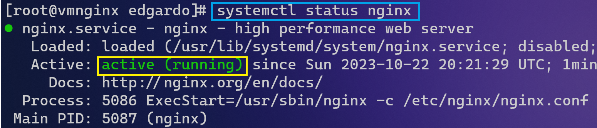

# Práctica 1 Instalación y configuración de nginx
## Lab: Netec
  
### Scenario
  
Al final de la práctica se espera que el participante pueda observar en funcionamiento su servidor de nginx. 

Esta práctica está pensada para un sistema operativo CentOS / Red---Hat

### Objectives
  
-Instalar nginx.

-Familiarizarse con los principales comandos de nginx.

### Lab Setup

**1*. Instalación de nginx.

**1.1** Abrir la terminal de nuestro servidor. 

>***firmate con el usuario y contraseña compartido por el instructor***

**1.2**	Iniciar el super usuario. Consejo: Para cualquier instalación o configuración se recomienda usar el super usuario en nuestro Linux. 

Usar el siguiente comando:
~~~
sudo su
~~~

>**Netec@APItest:~$ sudo su**
>**root@APItest:/home/Netec#**

**1.3**	Actualizar los repositorios usar el comando: yum update
~~~
yum update
~~~ 

**1.4**	Instalar nginx usando el comando:
~~~
yum install nginx
~~~
 

**1.5**	Esperar la instalación unos minutos, cuando se termine de instalar usar el comando systemctl status nginx para observar el estado del servidor, la primera vez que se instale el servidor estará en estado inactivo: 

**1.6**	Iniciar el servidor de nginx con el comando: 

~~~
systemctl start nginx
~~~

**1.7** Validar que el servidor este iniciado con el comando: 
~~~
systemctl status nginx
~~~

**1.8**	Obtener la IP pública de tu servidor usando el siguiente comando:
~~~
curl ifconfig.me
~~~
 
 ***Ten en encuenta que la dirección publica puede ser diferente en tu laboratorio***

 **1.9** 1.9	Abrir un explorador web y pegar la IP pública de tu servidor: 
