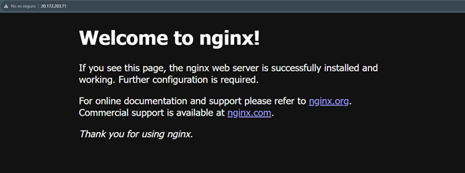

# Práctica 2: Configurando servidor virtual
  
### Scenario
  
Al final de la práctica se espera que el participante pueda observar una página web con su información cómo la que aparece en la siguiente pantalla: . 

### Objectivos:
  
- Adaptarse a los archivos de configuración principales de nginx.

- Crear un servidor virtual en nginx.
- Probar los comandos de listen, server_name, location.
- Crear un archivo html para mostrar una salida en el servidor web.

### 1.	Validar la instalación y servicio de nginx.

**1.1** Activar el super usuario en Linux. 

~~~
sudo su
~~~
**1.2**	Usar el siguiente comando para validar el estado de nginx: 
~~~
systemctl status nginx
~~~
**1.3**	En el dado caso que el servicio se encuentre en estado inactivo (como en la imagen anterior) activar el servicio usando el siguiente comando:
~~~
systemctl start nginx
~~~ 
**1.4**	Volver a validar el estado de nginx usando el siguiente comando:
~~~
systemctl status nginx
~~~
**1.5**	Si el estado de nginx aparece como running entonces podemos pasar a la siguiente sección. 

### 2. Configuración de archivo html.

**2.1** En la carpeta de **/home/user** crear una carpeta con el nombre **proyectosCurso**.

Usar el comando **pwd** para validar la ruta donde nos encontramos. 

**2.2** Usar el comando **mkdir proyectosCurso** para crear la carpeta en **home** de nuestro usuario.
~~~
mkdir proyectosCurso
~~~
**2.3**	Ahora debemos dirigirnos a la carpeta que acabamos de crear usaremos el comando **cd proyectosCurso**
~~~
cd proyectosCurso
~~~
**2.4** Dentro de la carpeta **proyectosCurso** crearemos otra carpeta llamada **practica1** y nos movemos dentro de la carpeta
~~~
mkdir practica1
~~~
~~~
cd practica1
~~~
**2.5**	Dentro de la carpeta **practica1** descargaremos el archivo **html** usando el siguiente comando:
~~~
curl -o index.html https://raw.githubusercontent.com/EdgardoVelasco/course_nginx/master/practica1/index.html
~~~
el comando descargará un archivo **html** que contiene el diseño de nuestra pagina web.

**2.6**	Ahora debemos de crear una carpeta que llamaremos **miapp** en la ruta ***/usr/share/nginx/html** usaremos el siguiente comando para realizarlo:
~~~
mkdir /usr/share/nginx/html/miapp
~~~
**2.7**
